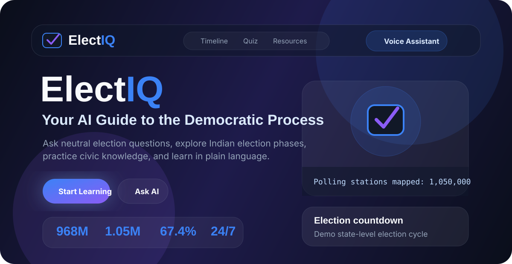
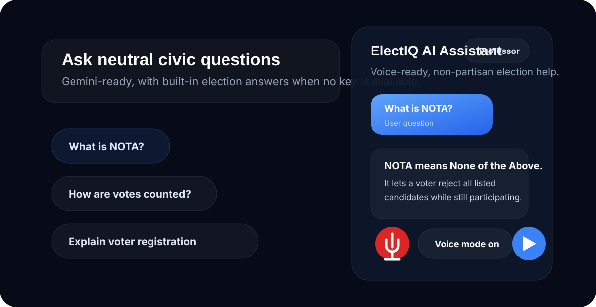
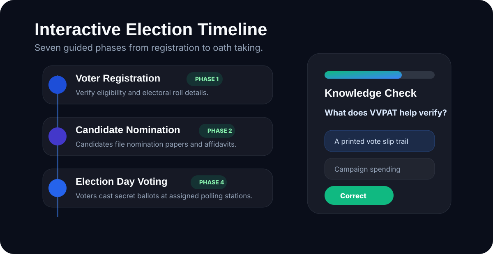

# ElectIQ - AI-Powered Election Education Assistant



<p align="center">
  
  
</p>

## Chosen Vertical
Election Process Education.

ElectIQ is a non-partisan civic learning assistant focused on election processes, voter registration, polling, vote counting, and democratic participation. The content is India-first, with notes that rules vary across democracies.

## Live Demo
Live app: [ElectIQ on Google Cloud Run](https://electiq-assistant-5acpuyx6fa-el.a.run.app)

Public repository: [electiq-assistant](https://github.com/virajthukrul0404-stack/electiq-assistant)

## Features
- AI-style chatbot with Gemini streaming support and a built-in offline election knowledge fallback.
- Voice assistant mode using Web Speech API speech recognition and speech synthesis.
- Interactive seven-phase election timeline with focused "Ask AI" prompts.
- Ten-question election quiz with score tracking, answer reveal animation, and study tips.
- Voting eligibility checker for India and several other democracies.
- Persona switcher: Professor, Gen Z Guide, and News Anchor.
- Google Translate widget, Google Fonts, Google Material Icons, and GA4 snippet.
- Accessibility controls for font size, high contrast, keyboard navigation, and screen-reader announcements.
- Dark/light theme with premium civic-tech styling.

## Approach & Logic
The app is intentionally static and lightweight: HTML, CSS, and vanilla JavaScript only. Core civic data lives in `data/election-data.json`, while UI modules in `scripts/` handle timeline rendering, quiz logic, voice controls, chat rendering, and Gemini requests.

Gemini is optional at runtime because public client-side keys can be revoked or restricted. If no valid key is saved, ElectIQ still answers using the local election knowledge base. This keeps the assistant usable during evaluation while preserving support for real Gemini streaming when the evaluator adds a fresh key through the key button in the chat header.

## Google Services Used
- Gemini Flash API via `generativelanguage.googleapis.com` for live AI answers when a valid key is provided.
- Google Fonts: Space Grotesk, Inter, and JetBrains Mono.
- Google Material Icons for interface symbols.
- Google Analytics GA4 with measurement ID `G-ELECTIQ2026`.
- Google Translate Widget in the footer for multilingual support.

## How It Works
```text
User input
   |
   v
Chat / Voice / Timeline / Quiz UI
   |
   +--> Gemini streamGenerateContent API if a valid browser-saved key exists
   |
   +--> Local election knowledge fallback if Gemini is unavailable
   |
   v
Sanitized answer rendered in chat, optionally read aloud by SpeechSynthesis
```

## Tech Stack
- Vanilla HTML, CSS, and JavaScript
- Google Gemini REST streaming endpoint
- Web Speech API
- DOMPurify CDN for response sanitization
- Canvas Confetti CDN for perfect quiz scores
- Browser localStorage for non-sensitive preferences and chat history
- Browser sessionStorage for an optional user-provided Gemini key during the current tab session

## Setup & Run
1. Clone the repository.
2. Start a static server from the project root:
   ```bash
   python -m http.server 8080
   ```
3. Open `http://localhost:8080`.
4. Optional: click the key icon in the chat header and save a fresh Gemini API key from Google AI Studio for live Gemini responses.

The app also includes an embedded data fallback so the main page can still render when opened directly as `index.html`, though a local server is recommended for browser tests and JSON loading.

## Assumptions
- The user has a modern browser; Chrome or Edge is best for voice recognition.
- Eligibility results are educational snapshots, not legal advice.
- Gemini keys should not be committed to a public repository; users provide their own key locally if needed.
- Local fallback answers are scoped to election and civic education topics.

## Security Measures
- No active secret API key is committed.
- Chat input is capped at 500 characters.
- User messages are rendered with `textContent`.
- Assistant HTML is sanitized with DOMPurify.
- Gemini calls are rate-limited client-side.
- CSP meta tag limits allowed script and network sources.
- localStorage stores only non-sensitive preferences and chat history. Optional Gemini keys are session-only and are not committed.

## Accessibility
- Skip link to main content.
- Visible focus rings on interactive controls.
- ARIA labels and live regions for chat and dynamic status.
- Font scaling controls and high contrast mode.
- Semantic sections, forms, buttons, and keyboard-friendly interactions.

## Testing
Run the browser test suite at:

```text
http://localhost:8080/tests/test.html
```

The suite validates JSON structure, quiz data, timeline phases, sanitization, rate limiting, localStorage, voice fallback behavior, font scaling, Gemini prompt construction, and quiz score calculation.
